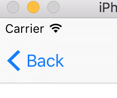

# WCBarButtonItem
A mimic of UIBarButtonItem

### WCNavBackButtonItem
A mimic of backBarButtonItem, which can't be replaced custom UIBarButtonItem.



#### Usage
```objective-c
WCNavBackButtonItem *backItem = [[WCNavBackButtonItem alloc] initWithTitle:title style:UIBarButtonItemStylePlain target:self action:@selector(backItemClicked:)];
self.navigationItem.leftBarButtonItems = @[[WCNavBackButtonItem navBackButtonLeadingSpaceItem], backItem];
```

### WCBarButtonItem (Deprecated)
A mimic of UIBarButtonItem, which can be used in iOS 6, has a style like iOS 7+.

## Author

wesley_chen, wesley4chen@gmail.com

## License

WCTextField is available under the MIT license. See the LICENSE file for more info.